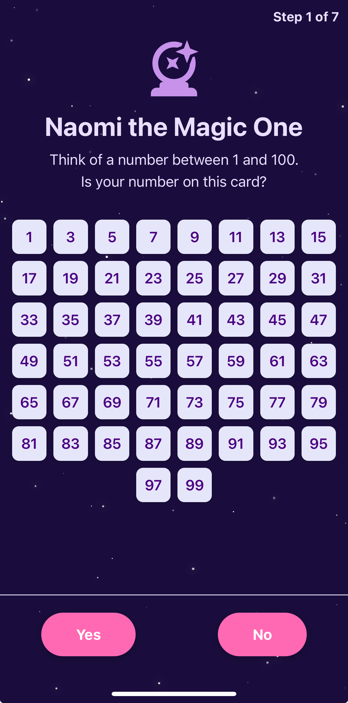

# Naomi La Maga



Welcome to "Naomi La Maga," a fun and engaging number guessing game built with React Native and Expo.

## 🎮 How to Play

The game is simple. A secret number is chosen, and you have to guess it. With each guess, you'll get a hint telling you if your guess is too high or too low. Use the hints to find the number and win!

## ✨ Features

-   **Cross-Platform**: Play on the web, iOS, and Android thanks to React Native and Expo.
-   **Simple & Fun**: An easy-to-learn game for all ages.
-   **Multi-language**: Supports multiple languages.

## 🚀 Getting Started

To run this project locally, follow these steps:

1.  **Clone the repository:**
    ```bash
    git clone https://github.com/your-username/naomi-la-maga.git
    cd naomi-la-maga
    ```

2.  **Install dependencies:**
    ```bash
    npm install
    ```

3.  **Run the application:**
    -   To run on iOS: `npm run ios`
    -   To run on Android: `npm run android`
    -   To run on the web: `npm run web`

## 🛠️ Built With

-   [React Native](https://reactnative.dev/) - A framework for building native apps using React.
-   [Expo](https://expo.dev/) - A framework and a platform for universal React applications.
-   [TypeScript](https://www.typescriptlang.org/) - A typed superset of JavaScript that compiles to plain JavaScript. 